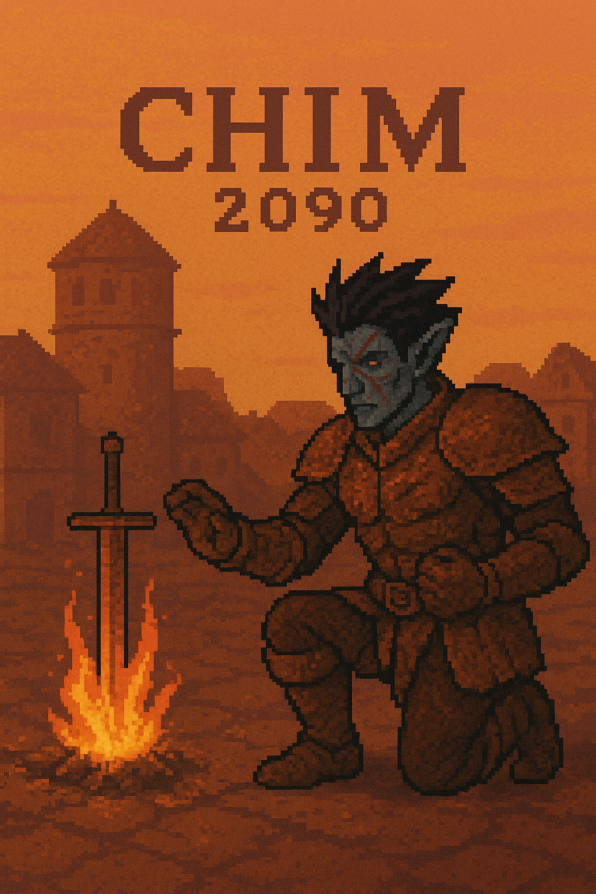

# CHIM 2090

<div align="center">
  <figure>
    
    <figcaption><h2 class="notoc">Souls-like Combat Overhaul</h2></figcaption>
  </figure>
  <br>
  <br>
</div>

## Requirements

<ul style="list-style-type: none;" align="center">
  <li><a href="https://www.nexusmods.com/morrowind/mods/56417"></a></li>
  <li><a href="https://openmw.org/downloads"></a></li>
</ul>
<br>

## Installation

## Overview

CHIM 2090 is a modernized interpretation of the MWScript classic, CHIM Movement and Stamina. It has a hard requirement for OpenMW 0.50, due to extensive use of its onHit feature.

At its core, CHIM is a highly advanced damage scaing mod, taking many factors into account. There are four core systems in CHIM:

1. Dynamic Stat Management - CHIM completely takes over management of fatigue capacity and regeneration for all actors, whilst also managing caps on health and magicka. Because of the popularity of existing magicka regeneration mods and the lack of sense in doing health regeneration at all, CHIM doesn't attempt to modify regeneration for these stats.
1. Blocking & Parrying - CHIM features active blocking with shields, and properly timed blocks can trigger a parry against your opponent, leaving them open for an attack.
1. Poise - Ripped 1:1 from Dark Souls 1, CHIM features an equipment-based poise system rewarding heavier gear. When one's poise is broken, they're knocked down, rendering them unable to attack and more vulnerable to damage.
1. Crits, Fumbles, and Damage Scaling - With CHIM, every attack always hits. To compensate for this whilst keeping weapon skills useful, incoming attack damage is scaled according to one's hit chance. For example, if your strike would normally have had 64% chance to hit, then, whatever damage you do will be 64% as effective. Alternatively, if you have a very high hit chance, such as 125%, you will do additional damage and be rewarded. To make things even more interesting, any actor may critically strike or fumble there attack at a configurable rate.

See each subsystem's respective section for details on what each one does and how to configure it. Each subsystem has its own settings page within the mod, all of which may be localized. In formulae shown in the documentation, every variable starting with a capital letter is a setting, such as `EnableCritFumble`.

### Dynamic Stats

CHIM alters the maximum capacity of all dynamic stats, and takes over fatigue regeneration completely. This is primarily to rebalance the combat experience and lower stat values out of the box. In most cases, vanilla formulae are reproduced and simply dehardcoded.

#### Fatigue

CHIM overrides the vanilla fatigue capacity and regeneration formulae, setting relevant GMSTs to 0. Those GMSTs are renamed and exposed as settings in the mod.

##### Fatigue Regen

```sh
fatigueThisFrame = FatiguePerSecond

if UseVanillaFatigueFormula:
  fatigueThisFrame += FatigueReturnMult * endurance.modified

# Multiply FatiguePerSecond by frameTime to ensure accurate timing
fatigueThisFrame *= deltaTime
```

##### Fatigue Capacity

```sh
fatigueWil = willpower.modified * ( MaxFatigueWilMult / 100 )
fatigueAgi = willpower.modified * ( MaxFatigueAgiMult / 100 )
fatigueEnd = willpower.modified * ( MaxFatigueEndMult / 100 )
fatigueStr = willpower.modified * ( MaxFatigueStrMult / 100 )

fatigueCapacity = round( fatigueWil + fatigueAgi + fatigueEnd + fatigueStr )
```

#### Magicka

CHIM Overrides the vanilla magicka capacity formula, but does not override its regeneration as this is well handled by other mods such as Pharis' Magicka Regen or Imperial Magicka Regen.

##### Magicka Capacity

```sh
if actor is Player:
  baseMagickaMult = PCbaseMagickaMultiplier
else:
  baseMagickaMult = NPCbaseMagickaMultiplier

fortifyMagickaFactor = fortifyMagickaEffect.magnitude * FortifyMagickaMultiplier

magickaMult = BaseMagickaMult + fortifyMagickaFactor

maxMagicka = round(intelligence.modified * magickaMult)
```

#### Health Capacity

```sh
totalHealth = BaseHealth

totalHealth += endurance.modified * HealthLinearMult

totalHealth += endurance.modified ^ HealthDiminishingExponent * HealthVitalityMult
```

### When A Hit Happens

Every hit will always be successful, as CHIM applies a massive fortify attack bonus to all actors. Sometimes this buff may be removed if an actor is resurrected or something similar - in such cases, CHIM will reapply the fortify attack bonus for their next strike.

Firstly, if the victim of a strike is a player, CHIM checks if the player is currently able to parry. If a parry is currently possible, normal hit behavior is skipped and the attacker's animation is interrupted. This is your chance to strike! See the [parrying](#parrying) section for more details.

If a parry isn't possible, but the player is blocking, damage mitigation is applied. The [blocking](#blocking) section will contain more details, but shield damage mitigation is primarily derived from the shield's weight and raw armor value.

After shield mitigation is calculated, the skill damage multiplier is derived. Basically, your hit chance is applied as a multiplier onto damage. This maintains the utility of weapon skill as it'll increase damage dealt as in later games, whilst allowing everyone to always strike successfully. See the [Damage Scaling](#damage-scaling)

Poise damage is then calculated for every strike. CHIM's poise implementation is copied nearly 1:1 from Dark Souls 1, rewarding the use of more equipment slots and heavier gear. See the [poise](#poise) section for more details on how the poise system can be leveraged - but be aware for now, that, when a defender's poise is broken, they'll be knocked down, and take more damage.

Finally, CHIM has a configurable global damage multiplier that is applied on top of block mitigation, hit chance multiplication, and poise multiplication, to magicka, health, and fatigue damage.

The final result looks something like this:

```lua
damage = damage 
        * shieldMult 
        * poiseMult 
        * globalDamageScaling 
        * hitChance
```

For more details, see each individual subsystem's documentation below and linked above. Each system's section explains its internal formulae, where each named variable is a setting within the mod.

### Parrying

When blocking, one may parry starting from the halfway point of the animation - approximately when the shield is at the center of your chest.

Triggering a parry will activate all normal functions of a block, eg sounds, animations, et cetera, except for durability loss. Use this to your advantage! Also, if you are using my [T4rg3t5](../t4rg3t5) mod, a successful parry will cause the lock icon to bounce as it would when hitting a target, for additional feedback.

Mind that this speed will increase along with your character's stats as described in [blocking](#blocking), but what's important for this section is the parry window for each shield.

#### Timings

Every shield is given a configurable number of parrying frames, based on a few of your character's attributes, and the weight of your shield.

The formula for calculating parry frames is as follows, with attributes capped at 100:

```sh
agilityBonus = (agility - 50) / 200 # -0.25 to 0.25

# Actually has nothing at all to do with luck attribute
luckBonus = ( random(10) - 5 ) / 50

# Heavier shields get less parry frames, whereas ligher ones have a bigger window
shieldFrames = max(0, BaseShieldFrames - floor(shieldWeight / PerUnitShieldWeightPenalty) )

totalFrames = BaseParryFrames + (blockSkill * BlockFrameMult) + agilityBonus + luckBonus + shieldFrames

totalFrames = clamp(totalFrames, MinParryFrames, MaxParryFrames)
```

The parry frames granted are then converted to seconds, assuming a frame duration equal to 60FPS. So, when feeling out parry timings, assume timings are designed around 60FPS, because they are. Mind, this mod will work at high refresh rates, but timings were more reliable when hardcoding parry logic to 60FPS.

#### Outgoing Damage

When you parry an opponent, you'll deal a certain amount of their attack's damage back to them as fatigue damage. That formula is here:

```sh
strengthBonus = strength.modified * StrengthDamageBonus

blockBonus = block.modified * BlockSkillBonus

shieldBonus = shieldSize * ShieldSizeInfluence # Uses the frontal surface area of the shield - bigger is better here!

damageMult = BaseDamageMultiplier + strengthBonus + blockBonus + shieldBonus

damageMult = clamp(damageMult, MinDamageMultiplier, MaxDamageMultiplier)

outgoingDamage = incomingDamage * damageMult
```

To get the parry timings for your shield, do the following in the console:

```lua
luap
I.s3ChimParry.getParryTimes
```

This will give you the parry timings for your shield in frames and seconds, along with its recordId and size (used for damage).
<br>

### Blocking

Make sure to bind a key for blocking, or it won't work at all! Blocking an attack will progress your block skill, damage your shield, consume fatigue, and mitigate incoming damage.

#### Durability Damage

As simple as it gets:

```sh
durabilityDamage = -( incomingDamage * damageMitigation ) 
```

See below for the damage mitigation formula.

#### Block Animation Speed

It's also worth mentioning that block animation speed is scaled according to various attributes of your character, including the weight of your carried shield. As before, assume all character attributes are capped at 100.

```sh
randomFactor = random(5) - 1 / 100.0

speedModified = ( luck.modified * BlockSpeedLuckWeight ) + ( agility * BlockSpeedAgilityWeight ) + randomFactor

shieldWeightPenalty = min( shieldWeight * ShieldWeightPenalty, ShieldWeightPenaltyLimit)

# Normalized Fatigue is current / total fatigue
blockAnimSpeed = ( BlockSpeedBase - weightPenalty ) + ( speedModified * normalizedFatigue )
```

The point of this formula is to allow speedy characters to block faster, even if using heavier shields. However, exhaustion will still counteract the bonus from your stats, making gear and fatigue a more significant faster than raw agility.

#### Damage Mitigation

Naturally the most important part of blocking with a shield!

```sh
armorComponent = remap(shieldArmor, 0, 75, 0.1, MaxArmorBonus)
weightComponent = remap(shieldWeight, 0, 50, 0.05, MaxWeightBonus)

shieldBaseMitigation = armorComponent + weightComponent

# The base level of the block skill is used as CHIM sets the block modifier VERY low to prevent normal blocks
# The default value of SkillMitigationFactor is 0.005, making a skill value of 100 cause the skillMultiplier to reach 1.0
# This is to raise the skill floor with damage mitigation, preventing shields from feeling uselessly weak at low block skills
skillMultiplier = 0.5 + (block.base * SkillMitigationFactor)

# CHIM uses the governing attribute associated with a shield's particular skill to determine the attribute bonus for damage mitigation
attributeBonus = shieldAttribute * AttributeMitigationFactor

totalMitigation = shieldBaseMitigation * skillMultiplier * normalizedFatigue + ( attributeBonus + BaseBlockMitigation )

if standingStill then
    totalMitigation = totalMitigation * StandingStillBonus

totalMitigation = 1 - clamp(totalMitigation, MinimumMitigation, MaximumMitigation)
```

The resulting value is then multiplied directly with incoming damage.

#### Fatigue Consumption

```sh
fatigueLoss = FatigueBlockBase + ( normalizedEncumbrance * FatigueBlockMult )

# attackStrength here refers to how charged an attack was
if attack was from a weapon:
    fatigueLoss = fatigueLoss + (weaponWeight * attackStrength * WeaponFatigueBlockMult)
```

It's worth mentioning this formula is derived directly from OpenMW source code, so this is exactly how block fatigue consumption already worked.

### Poise

Poise is a system which determines your character's sturdiness and ability to "tank" incoming attacks.

Mechanically speaking, poise is a hidden meter, which refills entirely after not having been struck for a certain amount of time. Every time you're hit, this timer resets. When your poise is broken by an attack, you're knocked down and will take more damage (2x by default), resetting your poise timer and preventing further poise damage until you've recovered.
  
Poise recovery time can be made faster by equipping more pieces of armoer. To increase your poise and be able to tank more hits, use heavier armor - or parry more and get hit less.

#### Maximum Poise

```sh
totalPoise = BasePoise

equipmentWeight = 0
for item in equipment:
    if item is armor:
        equipmentWeight += item.weight

equipmentPoise = min( totalWeight * PoisePerWeight, MaxEquipmentPoise)

strengthBonus = strength.modified * StrengthPoiseBonus
enduranceBonus = endurance.modified * EndurancePoiseBonus

totalPoise = totalPoise + equipmentPoise + strengthBonus + enduranceBonus

totalPoise = clamp(totalPoise, 0, MaxTotalPoise)
```

#### Poise Recovery Time

```sh
recoveryTime = PoiseRecoveryDuration

equipmentSlotMult = 1 - EquipmentSlotTimeReduction

for item in equipment:
    if item is armor:
        recoveryTime *= equipmentSlotMult
```

#### Poise Damage

Creatures, Weapons, and Hand-to-Hand attacks all cause different amounts of poise damage. Note that creatures with weapons will naturally use the weapon poise damage formula.

##### Unarmed Creatures

```sh
poiseDamage = CreatureBasePoiseDamage + ( strength.modified * CreatureStrengthPoiseFactor )

# attackStrength here is a measurement of how charged an attack was
poiseDamage *= ( attackStrength or 1.0 )
```

##### Weapons

```sh

weightPoise = weapon.weight * WeightPoiseFactor

# Uses the governing attribute associated with a weapon skill
skillPoise = weaponSkill * WeaponSkillPoiseFactor

# This should be *very* low!
strengthBonus = ( weightPoise + skillPoise ) * ( strength.modified * PoiseStrengthDamageBonus )

totalPoise = ( weightPoise + skillPoise + strengthBonus ) * WeaponPoiseMult * attackStrength

if attacker using two-handed weapon:
        totalPoise *= TwoHandedMult
```

##### Hand-to-Hand

```sh
skillPoise = handtohand.modified * HandToHandSkillPoiseFactor
strengthBonus = skillPoise * ( strength.modified * StrengthPoiseDamageBonus )
agilityBonus = skillPoise * ( agility.modified * AgilityPoiseBonus )

totalPoise = ( skillPoise + strengthPoise + agilityBonus ) * HandToHandPoiseMult * attackStrength
```

### Damage Scaling

Since CHIM uses the vanilla formula for calculating hit chance, I won't replicate it here. If you're curious, you may find it on the [OpenMW Wiki](https://wiki.openmw.org/index.php?title=Research:Combat#Hit_Chance). Be aware that this formula is used to calculate the damage multiplier on each hit, and that fortify attack bonuses are ignored since CHIM sets them to a drastically low value.

CHIM's internal damage formula however, is still relevant.

```sh
luckMod = min(luck.modified, 100) / 100.0 * CritLuckPercent

hitChance = min(MaxDamageMultiplier, nativeHitChance)
critChance = hitChance * (CritChancePercent / 100.0) * ( 1 + luckMod )

fumblePct = FumbleBaseChance / 100.0 # Subject to skill level
fumbleScalePct = FumbleChanceScale / 100.0 # Increases fumble chance regardless of skill level

fumbleChance = fumblePct + ( 1.0 - ( hitChance + luckMod ) ) * fumbleScalePct
fumbleChance = max(0.0, fumbleChance)

if EnableCritFumble:
  if roll < fumbleChance:
        hitChance *= ( FumbleDamagePercent / 100.0 )
  else if roll < critChance:
        hitChance *= CritDamageMultiplier
```

Luck plays an important factor in getting those critical hits, and in preventing fumbles. With default settings, a relatively skilled or lucky character generally shouldn't have to worry about fumbles - just massive incoming crits from enemy combatants.

### Equipment Capacity

Also like Dark Souls, CHIM adds an equipment capacity system which works in tandem with Morrowind's existing carrying capacity system. Determining equipment capacity is dead simple:

#### Formula

```sh
# Normalized endurance is current encumbrance / carrying capacity
normalizedEndurance = min(endurance.modified, 100) / 100

equipCapacity = carryingCapacity * ( 0.2 + normalizedEndurance * 0.3 )
```

#### Hit Animation Speed

So equipment capacity scales linearly with endurance, offering between 20% and 50% of your current carrying capacity. This is especially relevant for playing hit animations, whose speed scales according to your encumbrance:

```sh
if equipmentEncumbrance <= 0.25 then animSpeed = LightAnimSpeed
else if equipmentEncumbrance <= 0.5 then animSpeed = MediumAnimSpeed
else if equipmentEncumbrance <= 0.75 then animSpeed = HeavyAnimSpeed
else animSpeed = OverloadedAnimSpeed
```

## Credits

Author: **S3ctor**

Halbenull, for creating the original [CHIM](https://www.nexusmods.com/morrowind/mods/45694?file_id=1000010292)

You, for downloading this mod, and being the best.

All assets made by Dave Corley under the GPL3 license.

Please enjoy my mod, hack away as you please, and respect the freedoms of your fellow modders and players in the meantime.
