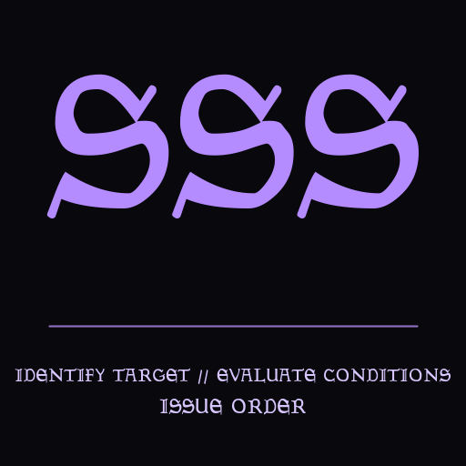

**Static Switching System (SSS)** is a declarative world-patching framework for OpenMW. Write YAML modules to replace meshes globally or in specific places, or to target live objects with conditions and apply object, inventory, actor, world-state, and scripting actions.

<!-- more -->

<div align="center">
  
</div>

SSS has two module types: static and instance. Pick one.

- **Static modules** replace meshes and maintain tracked replacement chains. They are the original Static Switching System path.
- **Instance modules** match active objects with conditions and apply rules such as replacement, transforms, inventory changes, actor equipment, locks, traps, creation, teleportation, tags, and other supported actions.

A YAML file must not combine `instances` with static replacement fields. When an object matches an instance rule, that pipeline owns the activation; static replacement is the fallback for objects with no matching instance rules.

## Dependencies and optional integrations

SSS depends on [H3lp Yours3lf](@/h3lp_yours3lf/index.md), so install and enable H3lp Yours3lf before testing SSS.

[FlexTag](@/flextag/index.md) is optional. It is required only by the tag feature family: `has_tag` and `cell_tag` conditions, plus `add_tag` and `remove_tag` actions. Without FlexTag's `FlexTagG` interface, those conditions return false and those actions cannot perform their operation, so a module that depends on them will appear inactive. SSS's static pipeline and its other instance conditions and actions do not require FlexTag. In particular, `cell_match` is an SSS location condition, not a FlexTag condition. See [FlexTag compatibility](@/static_switching_system/docs/compatibility/flextag.md) for tag data and persistence details.

{{ h3_usage(mod="Static Switching System") }}

## Mods already using SSS

SSS is already doing useful work in released static modules, not just in sample files:

- [White Suran 2 - MD Edition](https://www.nexusmods.com/morrowind/mods/44153) and [Red Vos](https://www.nexusmods.com/morrowind/mods/44729) use location-scoped mesh replacers for Suran and Vos.
- [Unique Velothi Interiors](https://www.nexusmods.com/morrowind/mods/57515), [G.A.S. - Green Azura Shrines](https://www.nexusmods.com/morrowind/mods/59752), and [Landscape - Aendemika of Solstheim](https://www.nexusmods.com/morrowind/mods/59755) use static modules for optional architecture and landscape components.
- [Suran O Suran - Compatibility Patches](https://www.nexusmods.com/morrowind/mods/59893), [On the Rocks Tamriel Rebuilt Compatibility Patch](https://www.nexusmods.com/morrowind/mods/58238), [Caverns Revamp - Cleaned-up and Compatible](https://www.nexusmods.com/morrowind/mods/57911), and [Anthony's Minor Mods and Patches](https://www.nexusmods.com/morrowind/mods/57811) use SSS for targeted compatibility work.

All nine are static modules. See [Static Modules in the Wild](@/static_switching_system/docs/recipes/static-modules-in-the-wild.md) for the full catalog and the authoring patterns they illustrate.

## Start here: a five-minute test

1. Install SSS and [H3lp Yours3lf](@/h3lp_yours3lf/index.md), enable `H3lp Yours3lf.esp`, and then enable `Static Switching System.esp`. Install [FlexTag](@/flextag/index.md) only if your module uses `has_tag`, `cell_tag`, `add_tag`, or `remove_tag`.
2. Create a YAML file below `scripts/staticSwitcher/data/` in an active OpenMW data directory:

   ```yaml
   log_name: SSS First Test
   instances:
     - conditions:
         - object_type: Creature
         - record_id: "^rat$"
       once: true
       actions:
         - transform:
             scale: 1.25
   ```

3. Load a cell containing a rat. The rat should become 25% larger; `once: true` keeps the successful application from being rolled again for that object after save/load.
4. If nothing happens, enable [debug logging](@/static_switching_system/docs/concepts/validation-and-debugging.md#debug-logging) and check [troubleshooting](@/static_switching_system/docs/compatibility/troubleshooting.md).

This test uses no replacement asset and is a quick way to verify the plugin, dependency, VFS path, module discovery, condition matching, and instance processing. Continue with [Your First Module](@/static_switching_system/docs/getting-started/first-module.md) for a fuller static-and-instance walkthrough.

## Choose a path

| Goal | Start here |
| --- | --- |
| Verify that SSS is installed | [Five-minute test](#start-here-a-five-minute-test) |
| Read the full documentation | [SSS documentation](@/static_switching_system/docs/_index.md) |
| Replace meshes globally or by location | [Basic static replacement](@/static_switching_system/docs/recipes/basic-static-replacement.md) |
| Change active objects based on conditions | [Your First Module](@/static_switching_system/docs/getting-started/first-module.md) |
| Add inventory, locks, traps, or equipment | [Loot, locks, and traps](@/static_switching_system/docs/recipes/loot-locks-traps.md) |
| Use quests or world state | [Quest-state world patching](@/static_switching_system/docs/recipes/quest-state-world-patching.md) |
| Study strange multi-primitive combinations | [Experiments and Oddities](@/static_switching_system/docs/experiments/_index.md) |
| Inspect or debug a loaded installation | [Validation and Debugging](@/static_switching_system/docs/concepts/validation-and-debugging.md) |
