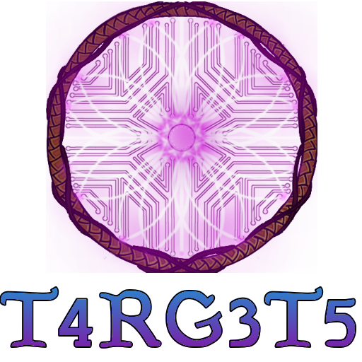

T4rg3t5 is a comprehensive Dark Souls-style lock-on targeting system for OpenMW that provides precise enemy tracking, visual target indicators, and intelligent combat automation.

The marker color tracks health continuously across six configurable colors, from full health to dead.

<!-- more -->

  <figure>
    
    <figcaption><h2 class="notoc">Morrowind Lock-On Targeting System</h2></figcaption>
  </figure>
   
   

## Requirements

  
  
   

## Overview

Target indicators also grow in size dynamically according to how far away your target is. Targets blocked from view are rejected when you lock on. `CheckLOS` can additionally keep checking visibility after a target is acquired. Offscreen candidates are rejected as well.

T4rg3t5 listens to OpenMW's combat-target updates instead of scanning every actor in the world.

T4rg3t5 comes with a full suite of 31 icons to use for lock-on indicators.

Assign a keybinding under **Settings → T4rg3t5 → Target Lock Core**, or the mod will be (mostly) useless.

For integrations, see the [T4rg3t5 documentation](@/t4rg3t5/docs/_index.md).

## Core Features

### Smart Target Acquisition

- Automatic Target Selection: Finds the nearest eligible combat target in your field of view
  

- Line-of-Sight Checking: Ensures targets are actually visible and not behind obstacles

- Flick Switching: Quickly change targets by flicking the mouse left or right

Combat Auto-Lock: Automatically locks onto enemies who initiate combat with you
  

T4rg3t5 controls vanilla crosshair visibility as part of its target-lock presentation: the vanilla crosshair is hidden during a semantic target lock and shown while unlocked. It is intentionally not designed to coexist with other crosshair mods, and it does not restore an unknown previous visibility state.

### Visual Target Indicators

1. Dynamic Lock Icons: Customizable target markers that scale with distance

1. Health-Based Coloring: Icon color changes based on enemy health status:

    - Full Health (100%+): Primary color

    - Very Healthy (80-100%): Mix with full health color

    - Healthy (60-80%): Distinct healthy state

    - Wounded (40-60%): Noticeable wound indication

    - Very Wounded (20-40%): Critical condition warning

    - Dead/Dying (0-20%): Near death state
  

1. Hit Feedback: Icons "bounce" when you successfully hit locked targets
  

1. Distance Scaling: Icons grow/shrink based on target distance

### Intelligent Automation

1. Auto-Facing: Character automatically turns to face locked targets

1. Weapon Awareness: Only allows locking when wielding weapons

1. Smart Target Management:

    - Automatically switches targets when current target dies

    - Breaks lock when targets move out of sight

    - Releases lock when sheathing weapons
