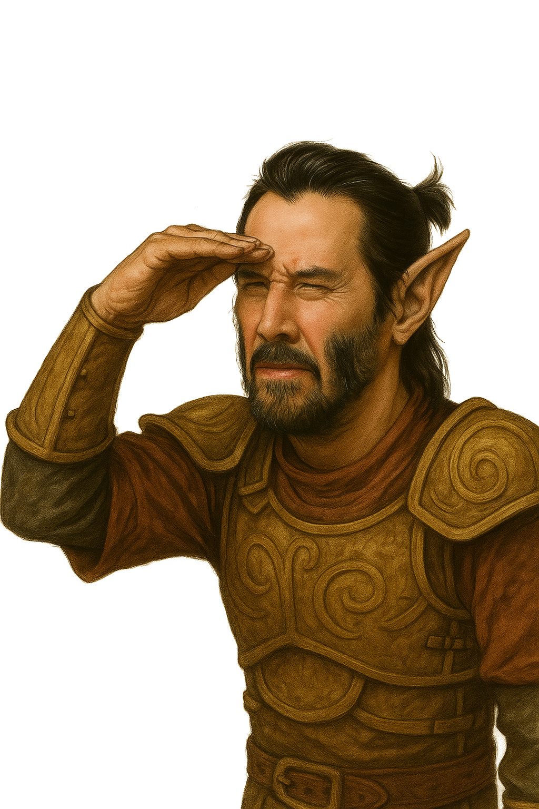

# Hawk3ye

<div align="center">

  <figure>
    
    <figcaption><h2 class="notoc">Brought to You by the Love and Passion of Modding-OpenMW.com</h2></figcaption>
  </figure>

  <br>
  <br>
</div>

Hawk3ye was inspired by [Zoom To See](https://www.nexusmods.com/morrowind/mods/57046?tab=description). However, when eyeing it for my own personal setup, I found the mod was broken and wasn't really very satisfying overall. So, I refactored it for greater reliability and mod compatibility.

Two simple keybinds are added - `Toggle Zoom` and `Hold Zoom`. The recommended defaults are `Z` and `Mouse Wheel Click`, respectively. Zooming in uses a smooth, exponential curve to decrease/increase the camera FOV as needed.  

If you just want to install the mod, read the `Installation` and `Usage` sections. For Lua scripters, view the table of contents for more details.

## Installation

## Usage

Warning! Hawk3ye needs just a bit of setup before it will work in your game. Make sure to hit the `Escape` key, go into `Settings -> Scripts -> Hawk3ye`, and set bindings for hold/toggle as needed. If you want, you can also set a fixed duration for the Zoom to reach its lowest FOV, and a target FOV when zooming.

### Hawk3ye for Modders

Hawk3ye uses events to trigger zooming, and takes advantage of OpenMW's more advanced input features to allow greater compatibility/interoperability. There also is an interface provided to check zooming state and better inform eventHandlers listening for Hawk3ye's zoom event.

#### Events

Hawk3ye uses one core event to control zooming - `Hawk3yeToggle`. It is provided a single argument which is a `ZoomType` (enum available in Hawk3ye's interface). To interrupt or prevent zooming, register a handler for this event and return `false` from that function.

##### ZoomType Specification

```lua
--- Used for determining what kind of state change occurred. This enum can also be re-used
--- When emitting your own Hawk3yeToggle events.
---@enum ZoomType
local ZoomState = {
    RESET = 1,
    DISABLE = 2,
    ENABLE = 3,
}
```

##### Interface

Hawk3ye also offers an interface in `Player` scope, `I.Hawk3ye`.  

The various fields available are as follows:  

```lua
---@return boolean isZoomed Whether or not the zoom action is currently engaged. It cannot be overridden
isZoomed = function()
   return zoomActive
end,

---@return boolean whether or not the player is allowed to zoom. Any menu being open prevents zoom, in addition to the world being paused.
CanZoom = canZoom,

--- A read-only copy of the ZoomType enum for use in eventHandlers
---@type ZoomType
ZoomStates = ReadOnlyStates,
```

#### Settings

Hawk3ye's main settings group is a `Player` scoped storage section called `SettingsHawk3ye`. It contains the following keys and values:

1.`enabled` - `Checkbox` - Whether to use the mod's functions at all.  

1.`zoom_fov_degrees` - `Number` - Target FOV when zooming. The maximum value is always 1 less than the FOV configured in the settings menu. Default is 42.

1.`zoom_time` - `Number` - Actual duration of the zoom effect from start to finish. Up to 2.5, default 0.75.

1.`Hawk3yeToggle` - `inputBinding` - Button/key used to toggle zoom. Suggested default is `Z`.

1.`Hawk3yeHold` - `inputBinding` - Button/key used to hold zoom. Suggested default is `Mouse Wheel`.

## Credits

Author: **S3ctor**  

All code was written by Dave Corley under the GPL3 license. Please enjoy my mod, hack away as you please, and respect the freedoms of your fellow modders and players in the meantime.  

I pour my entire heart, soul, and talent into this community. If you appreciate my work, please, [please consider supporting me on Ko-Fi.](https://ko-fi.com/magicaldave)  

I would do this full-time if I could only afford to.  
