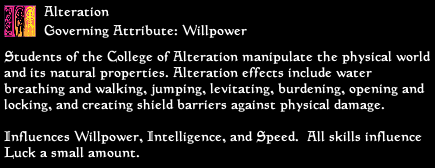
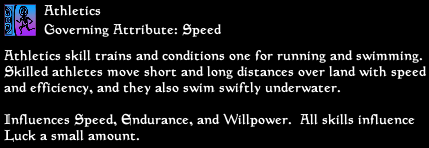
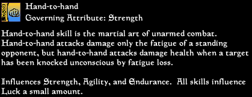
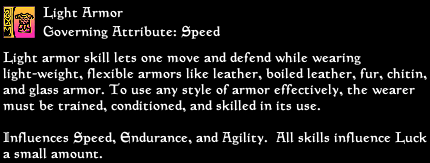
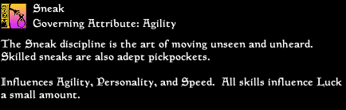
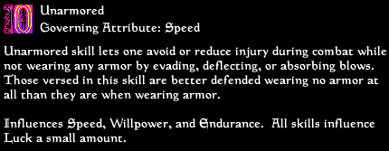

# Monochrome UI Supplement

Monochrome UI supplement is, well... a monochrome UI supplement.

Specifically, this mod replaces some of the built-in textures openmw provides and changes the default text color of Lua widgets. When Monochrome UI first released, there were no Lua widgets and replacing these built-in textures required invasive (and unsafe) modifications to one's game. Now, we can replace both much more easily.

This component only supports OpenMW 0.48 and later.

Additionally, this mod includes standard-defintion and 4X upscales of the Beta Morrowind skill icons. The originals can be found [here](https://tcrf.net/Prerelease:The_Elder_Scrolls_III:_Morrowind/Art_and_Textures). I just think they're neat.

## Before And After

    
    

## Beta Skill Images

    
    
    
    
    
    
    
    
    

#### Installation

1. Download the mod from [this URL](https://modding-openmw.gitlab.io/s3ctors-s3cret-st4sh/monochrome_ui_supplement)
1. Extract the zip to a location of your choosing, examples below:

        # Windows
        C:\games\OpenMWMods\monochrome_ui_supplement

        # Linux
        /home/username/games/OpenMWMods/monochrome_ui_supplement

        # macOS
        /Users/username/games/OpenMWMods/monochrome_ui_supplement

1. Add the appropriate data path to your `opemw.cfg` file (e.g. `data="C:\games\OpenMWMods\monochrome_ui_supplement"`)
1. For the skill icons modules, add either `data="C:\games\OpenMWMods\monochrome_ui_supplement\OPTIONAL - beta Skill icons HD"` or `data="C:\games\OpenMWMods\monochrome_ui_supplement\OPTIONAL - beta Skill icons SD"`

#### Credits

Author: **S3ctor**

- Bethesda Softworks for the original icons
- Glisp for deleting the icons off the CRF wiki page and making me find them
- Zavus for finding these and posting them on MCC in usable format

